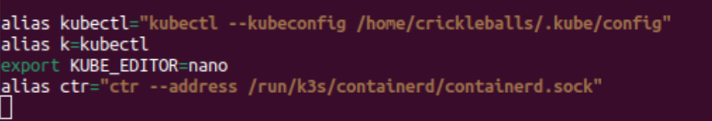

[Return Home](/README.md)


# Module 1: Kubernetes Development Environment Setup (Windows)

This guide will help you set up a Kubernetes development environment on your Windows machine using WSL and RKE2.

Please familiarize yourself with this process and these commands. If something doesn't make sense to you, don't just do it and move on. Seek answers, confirmation, and assistance to further your understanding about Kubernetes.

Before you start, if you happen to run a command and you see "command not found," all it typically requires is a sudo apt install [package] and it usually provides that  in the output, unless you misspelled.

This guide will assume you already have a functional Linux environment available as setting it up can be found within the documentation that pertains to your specific environment.

Options that are available: 
- WSL
- Virtualization (HyperV, VMWare, etc.)
- Bare Linux

---

**Before you start:**
If you are unfamiliar with linux or CLI commands, please do your due diligence and learn those. Please don't put random files where they shouldn't be, either. Usually I put mine in my user folder `/home/goblincoln/`. **Please be careful when deleting or modifying files.**

## 1. Install Kubernetes

### Option 1A: RKE2 (Rancher Kubernetes Engine - Government)

RKE2 is a hardened version of Kubernetes, often used in government environments. My tutorial will focus on using this until I provide documentation for the others.

- Follow the [RKE2 Quickstart Installation Guide](https://docs.rke2.io/install/quickstart).
- Read and execute the commands under **"Server Node Installation"**.

### Option 1B: Alternatives 

Alternative installation options (may have compatibility issues with this tutorial):
- [Install with snap on Ubuntu](https://ubuntu.com/kubernetes/install)
- [Minikube](https://minikube.sigs.k8s.io/docs/start/?arch=%2Fwindows%2Fx86-64%2Fstable%2F.exe+download)

---

## 2. Access Kubernetes Executables

We’ll make `kubectl`, `crictl`, and `ctr` available system-wide or for your user.

### Commands You’ll Use

- `ls`
- `cp`
- `chown user:user` (The first user sets the owner, the second user sets the group. This example gives your user full control)
- `chmod` (Look up documentation on this. It shouldn't be used freely. We probably want to give our files execute permissions for our user)
- Subcommands:
    - `-R` (recursive)
    - `-a` (show all)

### Steps

1. Locate the executables:
    ```
    /var/lib/rancher/rke2/bin
    ```
2. Copy `kubectl`, `crictl`, and `ctr` to your desired `bin` directory:
    - For all users: `/usr/local/bin`
    - For your user: `~/bin` (create if it doesn't exist)

3. If you get a "permission denied" error:
    - Change ownership (if in your user’s bin):
      ```sh
      sudo chown youruser:youruser ~/bin/kubectl ~/bin/crictl ~/bin/ctr
      ```
    - Or change permissions (if in `/usr/local/bin`):
      ```sh
      sudo chmod +x /usr/local/bin/kubectl /usr/local/bin/crictl /usr/local/bin/ctr
      ```

4. Test by running:
    ```sh
    kubectl version
    ```
    

---

## 3. Configure kubectl

1. Locate your `rke2.yaml` config file:
    ```
    /etc/rancher/rke2/rke2.yaml
    ```
2. Create a `.kube` directory in your home folder:
    ```sh
    mkdir -p ~/.kube
    ```
3. Copy the config file:
    ```sh
    sudo cp /etc/rancher/rke2/rke2.yaml ~/.kube/config
    ```
4. Change ownership:
    ```sh
    sudo chown youruser:youruser ~/.kube/config
    ```

---

## 4. Update Your `.bashrc` for Convenience

Add the following lines to your `~/.bashrc`:

```sh
alias kubectl="kubectl --kubeconfig /home/YOURUSERNAME/.kube/config"
alias ctr="ctr --address /run/k3s/containerd/containerd.sock"
alias k=kubectl
export KUBE_EDITOR=my_fav_editor
```
- if ~/bin isn't automatically found either, add `export PATH="$HOME/bin:$PATH"` to your .bashrc file as well.

- Replace `YOURUSERNAME` with your actual username.
- KUBE_EDITOR can be whatever you prefer. For example, if you wish to use `kubectl edit` on something, it will default to vim. This lets you choose nano if you're more comfortable with it.

**Tip:** Use `nano`, `vi`, or `vim` to edit `.bashrc`. Example:
```sh
nano ~/.bashrc
```

Apply changes:
```sh
exec bash
```
or close and reopen your terminal.



---

## 5. Other installs
- **k9s**: Terminal-based UI for Kubernetes.
    - [k9s Installation](https://k9scli.io/topics/install/), [GitHub](https://github.com/derailed/k9s)
    - Download and install per instructions on their page or go to the GitHub link for targeted installation instructions.
- **helm**: Kubernetes package manager.
    -  [Helm Docs](https://helm.sh/)
    - Copy the commands line-by-line.
    ```curl https://baltocdn.com/helm/signing.asc | gpg --dearmor | sudo tee /usr/share/keyrings/helm.gpg > /dev/null
    sudo apt-get install apt-transport-https --yes
    echo "deb [arch=$(dpkg --print-architecture) signed-by=/usr/share/keyrings/helm.gpg] https://baltocdn.com/helm/stable/debian/ all main" | sudo tee /etc/apt/sources.list.d/helm-stable-debian.list
    sudo apt-get update
    sudo apt-get install helm 
    ```
---

You should end up with these results if everything is working:


## Notes

- Practice using the command line for better muscle memory.
- Both `kubectl` and `k9s` are effective; use what works best for you. We might not always have k9s, but we will always have kubectl.

---

### Next - [2.1 K8 Manifests](../Module-2/L1/manifests.md)