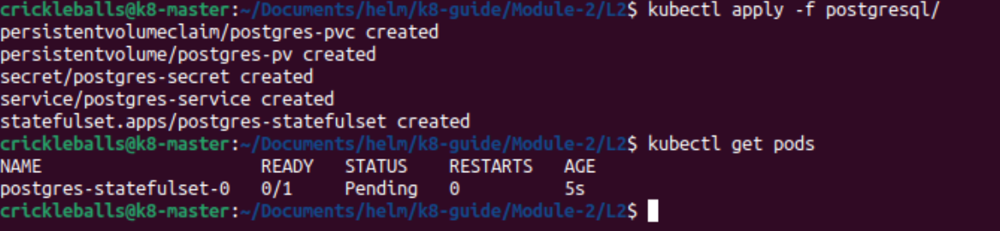
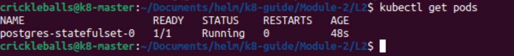
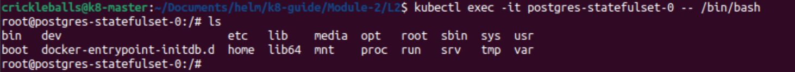

[Return Home](/README.md)

# Walkthrough

This will be a step-by-step guide to deploying PostgreSQL on Kubernetes. 

## Overview
PostgreSQL has five resources that we will apply to our cluster.
1. StatefulSet (Using a database)
2. Service
3. Secret
4. PVC
5. PV (for manual storage)

## Exercise

Look through the [PostgreSQL manifest](./postgresql/) files. The StatefulSet is the bread and butter of deploying an application in Kubernetes, so start with that.

### Things to Emphasize

- The **StatefulSet** is how we run our database Pod(s) with stable storage and identity. Unlike a Deployment, a StatefulSet keeps track of each Pod’s name and volume.

- The **Service** for this StatefulSet is a **headless Service** (`clusterIP: None`).
This means it doesn’t give you a single IP address. Instead, it creates DNS records for each Pod.
Databases like PostgreSQL need stable network identities, so this is important.

- The **Secret** is where we keep our sensitive info. In this case, the username and password.
Always base64 your secrets. For real clusters, you’d store this more securely.

- The **PVC** (PersistentVolumeClaim) asks for storage.
The **PV** (PersistentVolume) provides the actual storage from your node.
The PVC and PV must match on `storageClassName` (manual) and access mode.

- Notice how the Pod inside the StatefulSet uses `volumeMounts` to mount the storage at `/var/lib/postgresql/data`.
That’s where PostgreSQL keeps its database files. This file path will be different depending on your app.

---

## Next Steps

You do not want to apply the StatefulSet first. It depends on other resources to properly deploy its pods.

1. Apply the [Secret](./postgresql/postgresql_secret.yaml) first and check if it exists:
   ```bash
   kubectl apply -f postgresql_secret.yaml
   kubectl get secret
   ```

2. Apply the [pv/pvc](./postgresql/postgresql_pvc.yaml) (both are in one file):
    ```bash
    kubectl apply -f postgresql_pvc.yaml
    kubectl get pv
    kubectl get pvc
    ```
    You need to ensure it says "Bound" and not "Pending." If it says "Pending" you need to navigate your PV and look where it says `hostpath`. 
    
    Because we are manually provisioning our storage, and not using an application like Longhorn currently, we most likely need to manually create the directory assigned to `hostpath` depending on the permissions of your file system. If you plan on putting it in a protected directory like /mnt, you will have to use the `sudo` command.

    ```bash
    sudo mkdir /mnt/postgres-training
    ```
    It is possible that you will need to manipulate permissions on this directory to allow our application to make changes. If you created it in a protected directory such as /mnt, you require elevated permissions to even create the directory. 
    
    For now, you can give open permissions to the directory /mnt/postgresql-training
    ```bash
    sudo chmod -R a+rwx /mnt/postgres-training
    ```
    But, you won't want to do this in a production environment. Rather, depending on the application, you want to give it's user ownership of the directory.
    ```
    sudo chown -R postgrs:postgres /mnt/postgres-training
    ```

3. Apply the [Service](./postgresql/postgresql_service.yaml):
    ```bash
    kubectl apply -f postgresql_service.yaml
    kubectl get svc
    ```

4. Apply the [StatefulSet](./postgresql/postgresql_statefulset.yaml)
    ```
    kubectl apply -f postgresql_statefulset.yaml
    kubectl get pods
    ```




## After it's Running

### Monitoring
You can now perform various monitoring actions on your resource or pod. 
```
kubectl describe <resource-type> <resource-name>
kubectl logs <pod-name>
```


### Executing
If a Pod is running, you are allowed to use a shell provided by the image that the application is built on to **exec** into the Pod. For an application like PostgreSQL, you can do things like create a database directly inside your Pod. You can also browse the files and view the layout. Most Pods have a Unix-based file system.

Example:
```bash
kubectl exec -it <pod-name> -- /bin/bash
```
*-it means "integrated terminal"*

*/bin/bash is the location of the command to run the shell of your choice, typically located in the bin folder.*



## Exercise
We will not be making any databases directly in the pod, but here's a second exercise that will demonstrate how mounts work.

1. Remember where you made a mount `/mnt/postgres-training`? List the files in that directory and make note of what you see.
2. Exec into your postgres pod. Once you're in, list the files in the `/var/lib/postgresql/data` directory. Remember we have that in the statefulset? That is the path within the PostgreSQL container that database information is stored. It should look the same as what you have in `mnt/postgres-training`.


## Congrats! You deployed PostgreSQL on your K8s stack.

### Next - [Deploy PgAdmin Yourself](../L3/exercise.md)